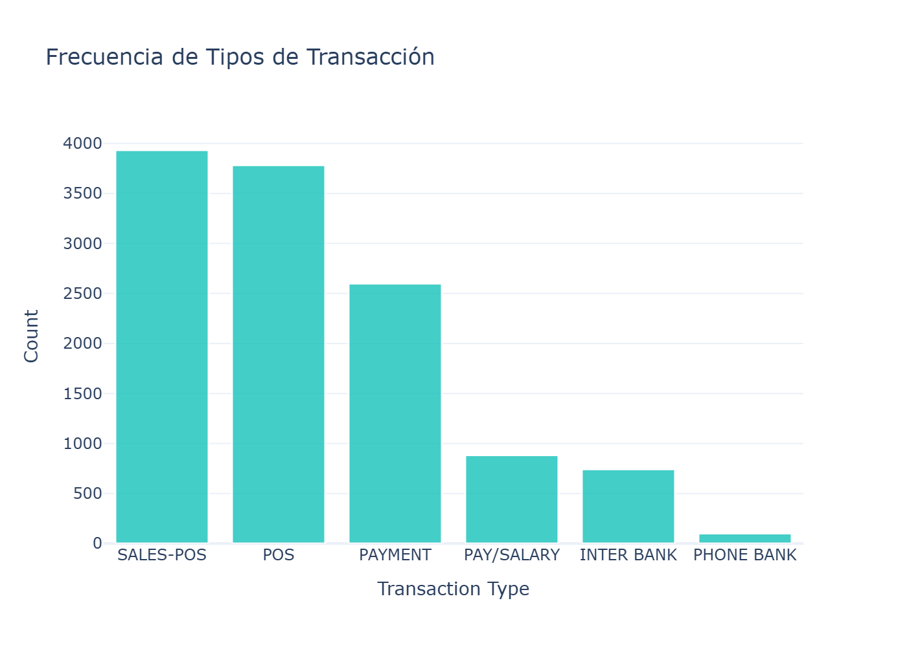
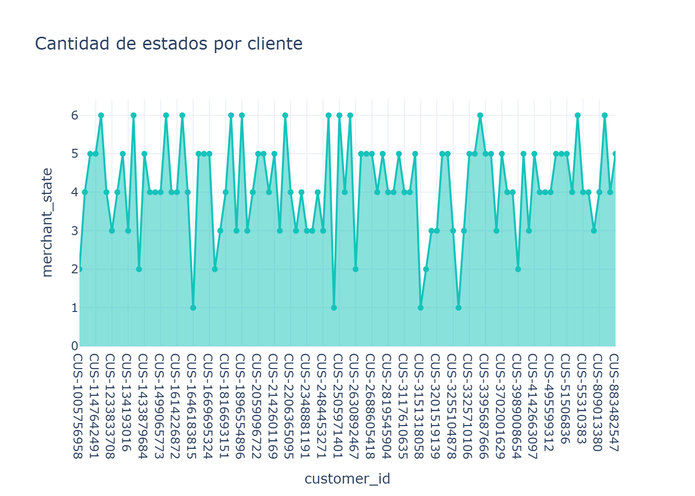

# Customer Transaction Predictive Analytics

This repository contains a comprehensive analysis of customer transactions, including spending behavior, demographic characteristics, hourly patterns, and variable correlations. All charts are located in the `graficos` folder.

---

## 1️⃣ Demographic Analysis

### Customer Age Distribution
  
Shows the distribution of customer ages in the dataset.

  
Another version of the age distribution for comparison and validation.

### Gender Distribution
  
Distribution of customers by gender.

---

## 2️⃣ Income and Spending Analysis

### Annual Salary Distribution
  
Displays the distribution of customers' annual salaries.

### Average Monthly Income
  
Shows the average monthly income of customers.

### Accumulative Spending by Hour and Age
  
Shows accumulated spending throughout the day, segmented by age group.

### Total Debit by Age
  
Total debit amount by age group.

### Total Debit by Age and Month
  
Total debit amount by age and month.

### Total Debit by Day of Week and Age
  
Total debit by day of the week and age group.

### Total Debit by Hour and Age
  
Total debit amount segmented by hour and age.

### Total Relative Transaction Count by Gender
  
Percentage distribution of transactions by gender.

---

## 3️⃣ Transaction Analysis

### Hourly Transaction Count by Day of Week
  
Number of transactions by hour and day of the week.

### Hourly Transaction Count by Day of Week (Relative)
  
Relative distribution of transactions by hour and day of the week.

### Hourly Transaction Count by Month
  
Number of transactions by hour and month.

### Hourly Transaction Count by Month (Relative)
  
Relative distribution of transactions by hour and month.

### Debit Transaction Frequency
  
Frequency of debit transactions per customer.

### Transaction Type Frequency
  
Number of transactions by type (debit, credit, etc.).

### Transaction Status Histogram
  
Distribution of transactions according to status (approved, declined, pending, etc.).

### Purchase States
  
Displays the purchase states of each transaction.

### Transactions by Card Present Flag
  
Distribution of transactions depending on whether the card was present.

### Transactions by Merchant State
  
Number of transactions per merchant state.

---

## 4️⃣ Variable Analysis and Correlations

### Feature Correlation to Annual Salary
  
Shows the correlation of each variable with the annual salary.

### Feature Importance for Total Debit
  
Shows which features have the greatest impact on customers' total debit.

### Top Customer Names
  
The most frequent customer names in the dataset.

---

## Notes

- All charts are located in the `graficos` folder.
- Image paths are relative, so they display correctly on GitHub.
- This README serves as a visual and explanatory guide for the customer transaction analysis.

📬 Contact
Luis Ramón Buruato
🔗 GitHub Profile

